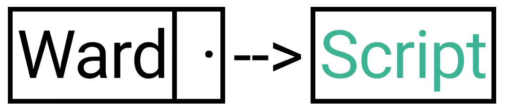

# WardScript

WardScript claims to be 2 things:

1. A high-level language
2. An useful and minimalistic programming language

The simplicity of wardscript makes it suitable for new programmers and those looking for a simple language
especially to implement algorithms and data structures in an understandable way.

## Requirements

* make
* bison
* clang/gcc (or another c compiler)

## Instalation

* Linux:

``` bash
git clone https://github.com/LuisAlbizo/WardScript
cd WardScript/src
make && make install
make clean
```


Once you have installed the interpreter; to execute a wardscript program just run:

```
ward script_name
```

## License

This project is under the MIT License. (see [License](./LICENSE))

## Tutorial

* [Wiki](https://github.com/LuisAlbizo/WardScript/wiki) (short tutorial, you already have to know programming)

## Author

> **Luis Albizo 2018**

